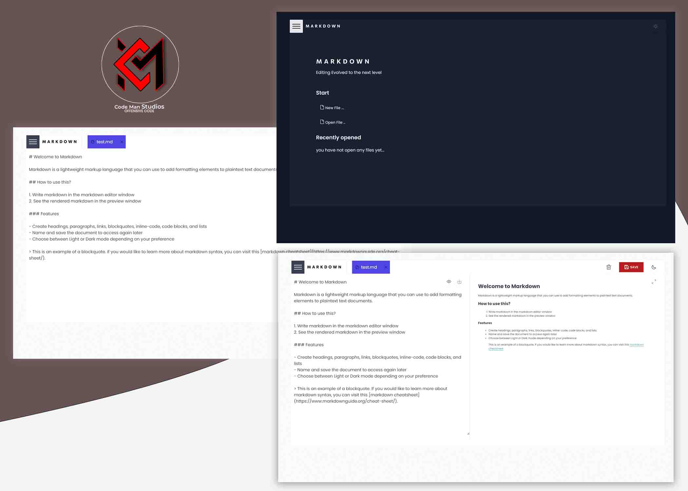

# In Browser Markdown Editor

A cool in-browser markdown editor

## Technologies Used

- React.js
- TypeScript
- React-Query
- Node.js
- Express
- Styled-Components
- React-Hot-Toast
- Redux and Redux Toolkit

## Installation

1. Clone the repository: [in-browser-markdown-editor](https://github.com/Aboagye-Dacosta/in-browser-markdown-editor)
2. Install dependencies.
3. visit [here](https://in-browser-markdown-editor-app.vercel.app/) to see it live

## Author

 Dacosta Aboagye Solomon

 

  
  
  

